# Blueprint v4.0: Sistema di Test Mercato Dinamico

**Autore:** Manus AI
**Data:** 17 Gennaio 2026
**Stato:** Progettazione

## 1. Obiettivo

Evolvere la "Modalità Test Mercato" in un sistema più integrato e realistico, abbandonando i pulsanti di test separati in favore di una logica interattiva basata sugli indicatori di stato dei posteggi (`Liberi`, `Occupati`, `Riservati`).

Il nuovo sistema replicherà la logica di successo della "Spunta", estendendola a tutti gli stati per simulare in modo fedele le operazioni di un'intera giornata di mercato: arrivo degli operatori, liberazione dei posteggi a fine giornata e assegnazione agli spuntisti.

Questo approccio unifica l'esperienza utente e permette di testare il sistema in condizioni reali, tracciando gli orari di arrivo e uscita e garantendo aggiornamenti in tempo reale sulla mappa.

## 2. Interfaccia Utente (UI) e Interazione

L'interfaccia verrà semplificata rimuovendo i pulsanti `Test Mercato`, `Avvio Spunta` e `Reset`. L'interazione avverrà direttamente tramite gli indicatori di stato dei posteggi.

### 2.1. Indicatori di Stato Attivi

Gli indicatori `Occupati`, `Liberi` e `Riservati` diventeranno cliccabili per attivare una delle tre modalità operative:

- **Modalità Libera:** Attivata cliccando sull'indicatore **Occupati**.
- **Modalità Occupa:** Attivata cliccando sull'indicatore **Liberi**.
- **Modalità Spunta:** Attivata cliccando il pulsante "✓ Spunta" sull'indicatore **Riservati** (logica esistente).

L'attivazione di una modalità disattiverà le altre per evitare conflitti.

### 2.2. Barre di Conferma Globale

Una volta attivata una modalità, apparirà una barra di conferma globale per eseguire l'azione su tutti i posteggi idonei, con animazione uno-ad-uno:

| Modalità Attiva | Indicatore Cliccato | Barra di Conferma | Colore | Azione Eseguita |
|---|---|---|---|---|
| `isLiberaMode` | **Occupati** | 🚮 **Libera Tutti** (`n` posteggi) | Rosso | Libera tutti i posteggi occupati. |
| `isOccupaMode` | **Liberi** | ✅ **Occupa Tutti** (`n` posteggi) | Verde | Occupa tutti i posteggi liberi. |
| `isSpuntaMode` | **Riservati** | ✓ **Conferma Assegnazione** (`n` posteggi) | Giallo | Assegna tutti i posteggi riservati (logica esistente). |

## 3. Flusso Operativo Dettagliato

### 3.1. Modalità Occupa (Simulazione Arrivo)

1.  **Attivazione:** L'utente clicca sull'indicatore **Liberi**.
2.  **Stato App:** `isOccupaMode` diventa `true`.
3.  **UI:**
    *   Appare la barra verde **"✅ Occupa Tutti"**.
    *   I posteggi liberi sulla mappa diventano interattivi per l'occupazione.
4.  **Azione Singola:**
    *   L'utente clicca su un posteggio **libero**.
    *   Appare un popup di conferma per l'occupazione (richiedendo l'impresa se non concessionaria).
    *   Alla conferma, viene chiamato `handleOccupaStall` che aggiorna lo stato in `occupato` e registra la presenza (orario di arrivo).
5.  **Azione Bulk:**
    *   L'utente clicca sulla barra **"✅ Occupa Tutti"**.
    *   Parte un'animazione che, uno ad uno, chiama `handleOccupaStall` per ogni posteggio libero, aggiornando la mappa in tempo reale.

### 3.2. Modalità Libera (Simulazione Uscita)

1.  **Attivazione:** L'utente clicca sull'indicatore **Occupati**.
2.  **Stato App:** `isLiberaMode` diventa `true`.
3.  **UI:**
    *   Appare la barra rossa **"🚮 Libera Tutti"**.
    *   I posteggi occupati sulla mappa diventano interattivi per la liberazione.
4.  **Azione Singola:**
    *   L'utente clicca su un posteggio **occupato**.
    *   Appare un popup di conferma per la liberazione.
    *   Alla conferma, viene chiamato `handleLiberaStall` che aggiorna lo stato in `libero` e registra l'orario di uscita sulla presenza del giorno.
5.  **Azione Bulk:**
    *   L'utente clicca sulla barra **"🚮 Libera Tutti"**.
    *   Parte un'animazione che, uno ad uno, chiama `handleLiberaStall` per ogni posteggio occupato.

### 3.3. Modalità Spunta (Logica Esistente)

La logica rimane invariata: l'attivazione tramite il pulsante "✓ Spunta" sull'indicatore **Riservati** abiliterà l'assegnazione dei posteggi riservati tramite popup singolo o barra di conferma gialla.

## 4. Backend e Database

Il sistema utilizzerà esclusivamente gli endpoint esistenti e robusti, garantendo coerenza e stabilità. Gli endpoint `/api/test-mercato/*` verranno deprecati e rimossi.

### 4.1. Endpoint API Utilizzati

| Metodo | Path | Descrizione |
|---|---|---|
| `PATCH` | `/api/stalls/:id` | Aggiorna lo stato di un posteggio (`libero`, `occupato`, `riservato`). |
| `POST` | `/api/presenze/registra` | Registra una nuova presenza (orario di arrivo). |
| `POST` | `/api/presenze/registra-uscita` | **(Nuovo)** Aggiorna una presenza esistente con l'orario di uscita. |

### 4.2. Modifiche al Database

*   **Tabella `vendor_presences`:**
    *   Aggiungere una colonna `exit_time` (timestamp, nullable) per memorizzare l'orario di uscita.

## 5. Schema Logico del Nuovo Flusso

```mermaid
graph TD
    subgraph Legenda
        direction LR
        Ind(Indicatore) --> Mode(Modalità)
        Mode --> Bar(Barra Globale)
        Mode --> Pop(Popup Singolo)
    end

    subgraph Flusso Occupa
        A[Click Indicatore Liberi] --> B(Attiva isOccupaMode)
        B --> C[Mostra Barra Verde 'Occupa Tutti']
        C --> D{Loop su posteggi liberi}
        D --> E[handleOccupaStall]
        B --> F[Click su Posteggio Libero]
        F --> G[Popup Conferma Occupazione]
        G --> E
    end

    subgraph Flusso Libera
        H[Click Indicatore Occupati] --> I(Attiva isLiberaMode)
        I --> J[Mostra Barra Rossa 'Libera Tutti']
        J --> K{Loop su posteggi occupati}
        K --> L[handleLiberaStall]
        I --> M[Click su Posteggio Occupato]
        M --> N[Popup Conferma Liberazione]
        N --> L
    end

    subgraph Azioni Comuni
        E --> P1[PATCH /api/stalls/:id]
        E --> P2[POST /api/presenze/registra]
        L --> P1
        L --> P3[POST /api/presenze/registra-uscita]
    end
```

